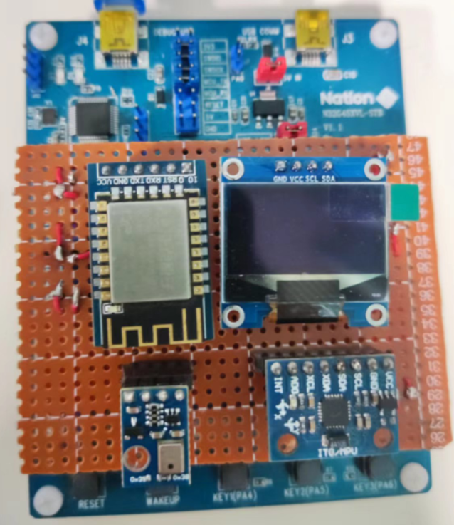
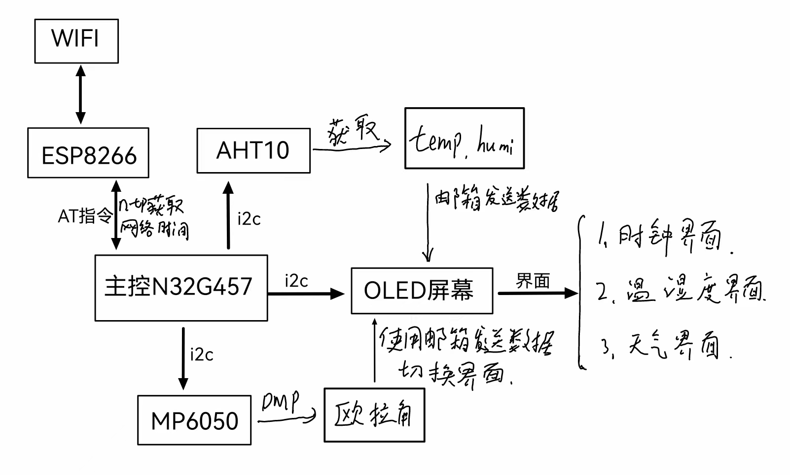
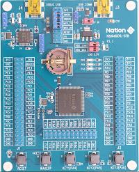
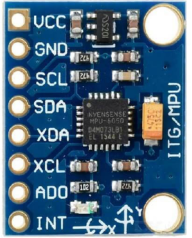
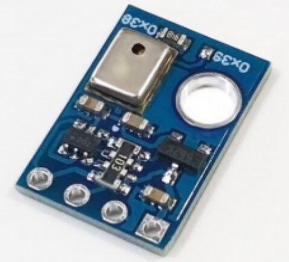

# Summer Project Description document

## 基于RT-Thread的桌面摆件

### 一：项目设计

#### 		项目背景

​		2022年7月参加RT-Thread夏令营，学习RT-Thread操作系统，经过两周的系统学习，将RT-Thread进行实践应用，根据自己手边有的模块（当时以离校）实现了自己的一个想法，当时浏览视频网站看到一位UP主设计了一个桌面摆件，所以就实现一个青春低配版的桌面摆件。目前可以实现联网功能、温湿度读取、天气读取功能。

#### 		应用场景

​		1：占用空间小，可以放置于桌面充当显示摆件而不占用很大空间。采用洞洞板飞线的方式，来减少杜邦线的连接，将模块与主控板连接成为一体，减少空间上的占用，更加小巧。

​		2：通过OLED显示时间。连接网络，获取网络实时时间，首次获取成功后断网也可以保持时钟准时。通过wifi模块连接网络，获取实时时间，将时间写进RTC中，不受网络依赖。将时间显示在OLED屏幕上，方便查看读取。

​		3：将温湿度显示在OLED屏幕上。通过AHT10读取环境的温湿度，将温湿度显示在屏幕上，查看方便快捷。

​		4：显示界面切换方便有趣，待机进入默认时钟界面。通过陀螺仪模块感知整个系统的状态，通过左右反转主控板来切换显示界面。在非时钟界面停留时键过长就会自动切换至始终显示界面。

### 二：项目概览图

​		作品使用到的模块通过洞洞板、飞线、排母和主控板连接，减少杜邦线对空间上的占用。



### 三：项目软硬件介绍

#### 1：软硬件架构图



#### 2：硬件说明

##### 		主控板

​		N32G457系列采用32 bit ARM Cortex-M4内核，最高工作主频144MHz。



##### 		ESP8266

​		ESP8266Wi-Fi模块作为可以进行WiFi传输的模块集成了业内领先的Tensilica L106超低功耗32位微型MCU，带有16位精简模式，主频可达160MHz。将AT固件烧录进ESP8266里面，使用RT-Thread的AT-device软件包，通过USART发送AT指令连接wifi。

##### 		MPU6050

​		MPU-6000（6050）的角速度全格感测范围为±250、±500、±1000与±2000°/sec (dps)，可准确追踪快速与慢速动作，并且，用户可程式控制的加速器全格感测范围为±2g、±4g±8g与±16g。采用I2c方式通信。使用DMP输出四元数，将四元数转化为浮点数，通过asin、atan2计算出欧拉角。



##### 		AHT10

​		aht10温湿度传感器，传感器包括一个电容式感湿元件和一个高性能CMOS微处理器相连接，温度范围为： 测量范围为 -40 ℃ ~+ 85 ℃ 精度±0.5℃。通讯方式采用I2c的接口方式。



#### 3：软件说明

main函数创建需要的线程与邮箱

##### main.c

```c
//线程创建

rt_thread_init(&thread_mpu,
            "name_mpu",
            thread_entry_mpu,
            RT_NULL,
            &thread_stack_mpu[0],
            sizeof(thread_stack_mpu),
            22,
            5);
    rt_thread_startup(&thread_mpu);

    rt_thread_init(&thread_aht10,
            "name_aht",
            thread_entry_aht10,
            RT_NULL,
            &thread_stack_aht10[0],
            sizeof(thread_stack_aht10),
            24,
            5);
    rt_thread_startup(&thread_aht10);


    rt_thread_init(&thread_date,
            "nam_date",
            thread_entry_date,
            RT_NULL,
            &thread_stack_date[0],
            sizeof(thread_stack_date),
            26,
            10);
    rt_thread_startup(&thread_date);

    rt_thread_init(&thread_oled,
            "nam_oled",
            thread_entry_oled,
            RT_NULL,
            &thread_stack_oled[0],
            sizeof(thread_stack_oled),
            28,
            5);
    rt_thread_startup(&thread_oled);

    rt_thread_init(&thread_tim,
            "name_tim",
            thread_entry_tim,
            RT_NULL,
            &thread_stack_tim[0],
            sizeof(thread_stack_tim),
            23,
            5);
    rt_thread_startup(&thread_tim);


/////////////////////////////////////////////
//创建邮箱与初始化定时器

    rt_err_t result;

    /* 初始化一个 mailbox */
    result = rt_mb_init(&mb_oled_date, "mb_od",
            &mb_pool_oled_date[0], /* 邮箱用到的内存池是 mb_pool */
            sizeof(mb_pool_oled_date) / 4, /* 邮箱中的邮件数目，因为一封邮件占 4 字节 */
            RT_IPC_FLAG_FIFO); /* 采用 FIFO 方式进行线程等待 */
    if (result != RT_EOK)
    {
        rt_kprintf("init mailbox failed.\n");
        return -1;
    }

    result = rt_mb_init(&mb_oled_mpu, "mb_om",
            &mb_pool_oled_mpu[0], /* 邮箱用到的内存池是 mb_pool */
            sizeof(mb_pool_oled_mpu) / 4, /* 邮箱中的邮件数目，因为一封邮件占 4 字节 */
            RT_IPC_FLAG_FIFO); /* 采用 FIFO 方式进行线程等待 */
    if (result != RT_EOK)
    {
        rt_kprintf("init mailbox failed.\n");
        return -1;
    }


    result = rt_mb_init(&mb_oled_aht, "mb_oa",
            &mb_pool_oled_aht[0], /* 邮箱用到的内存池是 mb_pool */
            sizeof(mb_pool_oled_aht) / 4, /* 邮箱中的邮件数目，因为一封邮件占 4 字节 */
            RT_IPC_FLAG_FIFO); /* 采用 FIFO 方式进行线程等待 */
    if (result != RT_EOK)
    {
        rt_kprintf("init mailbox failed.\n");
        return -1;
    }
```

##### mpu6050.c

```c
//mpu6050的初始化与DMP的初始化
#define MPU6XXX_DEVICE_NAME  "i2c3"

dev = mpu6xxx_init(MPU6XXX_DEVICE_NAME, RT_NULL);

while(mpu_dmp_init())
    {
        rt_thread_mdelay(500);
        rt_kprintf("\r\nMPU6050 Error\r\n");
    }

//获取欧拉角度并在角度变化时向OLED发送邮箱
while(1)
    {
        //            Read_DMP(&Pitch,&Roll,&Yaw);
        mpu_dmp_get_data(&Pitch,&Roll,&Yaw);
        pitch = Pitch;
        roll = Roll;
        yaw = Yaw;

//        printf(" Pitch = %lf, Roll = %lf, Yaw = %lf\n", pitch, roll, yaw);

        if(roll > 40 && flage == 1)
        {
            page ++;
            if(page >= Page_Max)
                page = 0;
            flage = 0;
            flage_tim = 1;
            rt_mb_send(&mb_oled_mpu, (rt_uint32_t)page);
        }
        if(roll < -40 && flage == 1)
        {
            if(page <= 0)
                page = Page_Max;
             page --;
             flage = 0;
             flage_tim = 1;
             rt_mb_send(&mb_oled_mpu, (rt_uint32_t)page);
        }

        if(roll < 30 && roll > -30)
        {
            flage = 1;
        }


        rt_thread_mdelay(10);
    }


//初始化设置定时器的超时时间 与超时函数

//超时函数
static rt_err_t timeout_cb(rt_device_t dev, rt_size_t size)
{
    rt_kprintf("this is hwtimer timeout callback fucntion!\n");
    page = 0;
    flage_tim = 1;
    rt_mb_send(&mb_oled_mpu, (rt_uint32_t)page);

    return 0;
}

//初始化并更新超时时间
if(Roll < 5 && Roll > -5 && page != 0)
        {
            rt_kprintf("in the tim\n");
            /* 设置定时器超时值为5s并启动定时器 */
            timeout_s.sec = 7;      /* 秒 */
            timeout_s.usec = 0;     /* 微秒 */
            if(flage_tim == 1)
            {
                flage_tim = 0;
                if (rt_device_write(hw_dev, 0, &timeout_s, sizeof(timeout_s)) != sizeof(timeout_s)    )
                {
                    rt_kprintf("set timeout value failed\n");

                }
            }
        }

        rt_thread_mdelay(500);

```

##### aht10.c

```c
#define AHT10_I2C_BUS  "i2c4"

//初始化注册aht10模块
int rt_hw_aht10_port(void)
{
    struct rt_sensor_config cfg;
    cfg.intf.dev_name  = AHT10_I2C_BUS;
    cfg.intf.user_data = (void *)AHT10_I2C_ADDR;
    rt_hw_aht10_init("aht10", &cfg);
    return RT_EOK;
}
INIT_APP_EXPORT(rt_hw_aht10_port);
//MSH_CMD_EXPORT(rt_hw_aht10_port,rere);


//打印函数
void aht_show_data(rt_sensor_t sensor, struct rt_sensor_data *sensor_data)
{
    switch (sensor->info.type)
    {
    case RT_SENSOR_CLASS_TEMP:

        LOG_I(" temp:%3d.%d C, timestamp:%5d", sensor_data->data.temp / 10, (rt_uint32_t)sensor_data->data.temp % 10, sensor_data->timestamp);
        break;
    case RT_SENSOR_CLASS_HUMI:

        LOG_I("humi:%3d.%d%%, timestamp:%5d", sensor_data->data.humi / 10, sensor_data->data.humi % 10, sensor_data->timestamp);
        break;
    default:
        break;
    }


}

//获取温湿度的线程
void thread_entry_aht10(void *param)
{
    static rt_device_t dev1 = RT_NULL, dev2 = RT_NULL;
    struct rt_sensor_data data;
    rt_sensor_t sensor1, sensor2;

    struct mesg_aht *mes;
    mes = (struct mesg_aht*)rt_malloc(sizeof(struct mesg_aht));

    dev1 = rt_device_find("temp_aht");
    dev2 = rt_device_find("humi_aht");
    if (dev1 == RT_NULL)
    {
        rt_kprintf("Can't find device");
        return;
    }
    if (rt_device_open(dev1, RT_DEVICE_FLAG_RDWR) != RT_EOK)
    {
        rt_kprintf("open device failed!");
        return;
    }
    if (rt_device_open(dev2, RT_DEVICE_FLAG_RDWR) != RT_EOK)
    {
        rt_kprintf("open device failed!");
        return;
    }

    sensor1 = (rt_sensor_t)dev1;
    sensor2 = (rt_sensor_t)dev2;

    while(1)
    {
        rt_device_read(dev1, 0, &data, 1);
        sprintf(mes->temp, "temp:%3d.%dC", (&data)->data.temp / 10, (rt_uint32_t)(&data)->data.temp % 10);

        rt_device_read(dev2, 0, &data, 1);
        sprintf(mes->humi, "humi:%3d.%d%%", (&data)->data.humi / 10, (&data)->data.humi % 10);

        mes->temp[11] = '\0';
        mes->humi[11] = '\0';

        rt_mb_send(&mb_oled_aht, (rt_uint32_t)mes);

        rt_thread_mdelay(100);
    }
}

```

##### oled.c

```c
void thread_entry_oled(void *param)
{
    u8g2_t u8g2;

    char  *test = RT_NULL;

    int num;

    struct mesg_date * str_date;
    struct mesg_aht * str_aht;
    str_aht = (struct mesg_aht*)rt_malloc(sizeof(struct mesg_aht));

    // Initialization
    u8g2_Setup_ssd1306_i2c_128x64_noname_f( &u8g2, U8G2_R0, u8x8_byte_sw_i2c, u8x8_gpio_and_delay_rtthread);
    u8x8_SetPin(u8g2_GetU8x8(&u8g2), U8X8_PIN_I2C_CLOCK, OLED_I2C_PIN_SCL);
    u8x8_SetPin(u8g2_GetU8x8(&u8g2), U8X8_PIN_I2C_DATA, OLED_I2C_PIN_SDA);

    u8g2_InitDisplay(&u8g2);
    u8g2_SetPowerSave(&u8g2, 0);


    u8g2_ClearBuffer(&u8g2);
    u8g2_SetFont(&u8g2, u8g2_font_ncenR18_tf  );
    u8g2_DrawStr(&u8g2, 0, 48, "Loading...");
    u8g2_SendBuffer(&u8g2);

    rt_kprintf("ole start ok\n");

    while(1)
    {
        //获取mpu线程发送过来的邮箱
        if (rt_mb_recv(&mb_oled_mpu, (rt_uint32_t *) &test, RT_WAITING_NO) == RT_EOK)
        {
            rt_kprintf("test = %d\n",test);
            num = (int)test;
        }

        if(num == 0)
        {
            if (rt_mb_recv(&mb_oled_date, (rt_uint32_t *) &str_date, RT_WAITING_FOREVER) == RT_EOK)
            {
                u8g2_ClearBuffer(&u8g2);
                u8g2_SetFont(&u8g2, u8g2_font_fub20_tf  );
                u8g2_DrawStr(&u8g2, 10, 55, str_date->hour);
                u8g2_SetFont(&u8g2, u8g2_font_helvR14_te );
                u8g2_DrawStr(&u8g2, 5, 18, str_date->mouth);
                u8g2_SetFont(&u8g2, u8g2_font_helvR14_te );
                u8g2_DrawStr(&u8g2, 80, 18, str_date->week);
                u8g2_SendBuffer(&u8g2);

                rt_thread_mdelay(1);
            }
        }

        if(num == 1)
        {
            if (rt_mb_recv(&mb_oled_aht, (rt_uint32_t *) &str_aht, RT_WAITING_FOREVER) == RT_EOK)
            {
                u8g2_ClearBuffer(&u8g2);
                u8g2_SetFont(&u8g2, u8g2_font_helvR14_te );
                u8g2_DrawStr(&u8g2, 10, 55, str_aht->temp);
                u8g2_DrawStr(&u8g2, 10, 22, str_aht->humi);
                u8g2_SendBuffer(&u8g2);

                rt_thread_mdelay(1);
            }
        }

    }

}
```

##### date.c

```c

void thread_entry_date(void *param)
{
    time_t now = (time_t)0;
    char *str = RT_NULL;
    
    struct mesg_date * mes;
    mes = (struct mesg_date*)rt_malloc(sizeof(struct mesg_date));
    
    time_t cur_time = ntp_get_time(RT_NULL);
    rt_device_control(rt_device_find("rtc"), RT_DEVICE_CTRL_RTC_SET_TIME, &cur_time);
    LOG_I("Get local time from NTP server: %s", ctime((const time_t *) &cur_time));
    rt_kprintf("date start\n");

    while(1)
    {
        now = time(RT_NULL
        str = ctime(&now);

        memcpy(mes->hour, str+11, 8);
        mes->hour[8] = '\0';
        memcpy(mes->year, str+20,4);
        mes->year[4] = '\0';
        memcpy(mes->week, str, 3);
        mes->week[3] = '\0';
        memcpy(mes->mouth, str+4, 6);
        mes->mouth[6] = '\0';

        rt_mb_send(&mb_oled_date, (rt_uint32_t)mes);//向oled线程发送邮箱-温湿度

        rt_thread_mdelay(500);

    }

}
```

### 四：视频链接

B站视频链接：https://www.bilibili.com/video/BV14t4y137hF?vd_source=8c3e22b8d49cc487000bc13102a1b755


### 五：项目总结

​		该项目由于时间紧迫采用了洞洞板，时间可以的话打样PCB会让该作品看着更加简洁。不采用主控开发板，全部元器件集成在一块PCB上，再打印3D外壳进行封装，会更加完美。

​		经过这段时间的系统的学习RT-Thread操作系统，让我对操作系统的实践应用有了更深一步的了解，特别是对于线程的创建、邮箱、信号量的使用。制作期间遇到各种各样的问题，通过与队友们的讨论解决，提高自己的Debug能力。最后感谢各位老师们的辛勤付出。


